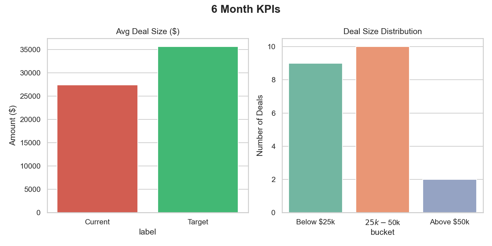
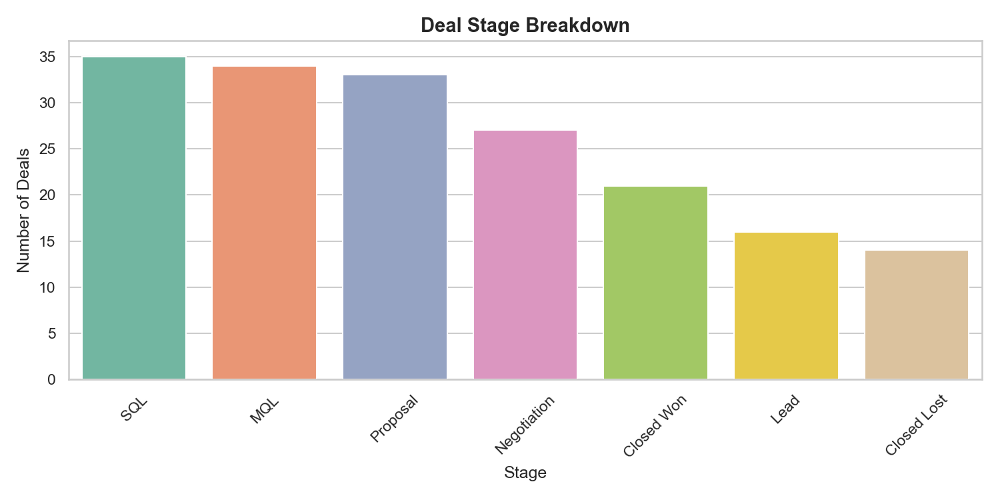
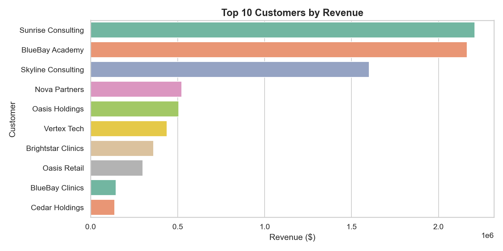

# Mugdad Elneama - Data Analyst Portfolio

📧 **Email:** megdad.2003@gmail.com  
💼 **LinkedIn:** [linkedin.com/in/mugdad-elneama-249a5a228](https://linkedin.com/in/mugdad-elneama-249a5a228](https://www.linkedin.com/in/mugdad-h-eltayeb-249a5a228/))  
📱 **Phone:** +971 56 675 4494  
📍 **Location:** Dubai, UAE

---

## About Me

Data Analyst with professional experience in data analysis, cleaning, EDA, and business intelligence. Proficient in Python,
SQL, Excel, and Power BI with proven ability to transform large datasets into actionable insights. Skilled at building
interactive dashboards, automating workflows, and communicating complex findings to technical and non-technical
stakeholders.Previously interned at Newcom, where I quantified a $62,000 revenue opportunity through data-driven analysis.

---

## Featured Projects

### **1. Newcom Revenue Growth Analysis – 90-Day Data-Driven Growth Plan**

**Technologies Used:** Python (Pandas, NumPy, Matplotlib, Seaborn), SQL, Power BI, Excel

#### Project Overview
Designed and executed an end-to-end data analysis workflow to identify revenue growth opportunities for Newcom. This project involved data collection, cleaning, transformation, exploratory data analysis (EDA), and visualization across 6 datasets to deliver a comprehensive 90-day strategic growth plan.

#### Key Achievements
- **Identified $62,000 revenue opportunity** through customer segmentation and product performance analysis
- Built a **KPI reporting framework** targeting 20% revenue growth and 30% increase in average deal size
- Performed **exploratory data analysis (EDA)** to uncover revenue gaps, sales patterns, and business opportunities
- Designed **interactive Power BI dashboards** to visualize key performance indicators including revenue performance, sales trends, and growth metrics
- Delivered a **data-driven strategic roadmap** with supporting visualizations to executive stakeholders

#### Technical Skills Demonstrated
- **Data Wrangling & Cleaning:** Merged and cleaned 6 datasets using Python (Pandas) to create analysis-ready data
- **Exploratory Data Analysis (EDA):** Statistical analysis to identify trends, patterns, and anomalies
- **Customer Segmentation:** Applied segmentation techniques to categorize customers and identify high-value targets
- **Product Performance Analysis:** Evaluated product portfolios to determine revenue drivers
- **Data Visualization:** Created comprehensive dashboards in Power BI and Python (Matplotlib/Seaborn)
- **SQL Querying:** Extracted and transformed data for analysis
- **Business Intelligence Reporting:** Developed KPI frameworks and presented findings to senior management

#### Project Visuals

*KPI dashboard showing current vs. target average deal size and deal size distribution*

*Analysis of deal progression across different sales stages*

*Revenue distribution across top-performing customers*

*Python code demonstrating data processing and analysis for Q1 insights*

*Customer segmentation and revenue analysis using Python (Pandas)*

---

### **2. UK Government Procurement Spending Analysis**

**Technologies Used:** Python (Pandas, Matplotlib, NumPy), SQL

#### Project Overview
Analyzed real public spending data from the UK Department for Science, Innovation and Technology (DSIT) covering monthly transactions over £25,000 from 2024 to 2025. This project provided transparent insights into how taxpayer money is allocated across suppliers, expense categories, and transaction types.

#### Key Achievements
- **Collected and merged 18 monthly CSV files** into a unified, analysis-ready dataset
- Performed **comprehensive data cleaning and wrangling** to handle inconsistent date formats, currency symbols, missing values, and duplicate records
- Conducted **statistical analysis and trend analysis** to identify top suppliers, spending categories, and year-over-year budget changes
- Built **data visualizations in Matplotlib** to communicate spending patterns and financial insights to stakeholders
- Applied **data validation techniques** to ensure completeness and accuracy of all findings

#### Technical Skills Demonstrated
- **Data Collection & Integration:** Combined 18 monthly datasets spanning two years
- **Data Cleaning:** Systematic handling of messy data including inconsistent formats and duplicates
- **Exploratory Data Analysis (EDA):** Asked and answered key business questions through data
- **Statistical Analysis:** Identified spending trends, top suppliers, and transaction patterns
- **Data Visualization:** Created clear, informative charts using Matplotlib
- **SQL Querying:** Data extraction and transformation for analysis
- **Python Programming:** Extensive use of Pandas for data manipulation and NumPy for calculations

#### Analysis Questions Addressed
- Where is the money going each month?
- Who are the biggest suppliers receiving government payments?
- Which expense categories consume the most budget?
- Are there unusually large transactions that need attention?
- How did spending change between 2024 and 2025?

#### Project Visuals

*Project overview explaining the dataset and analysis approach*

*Python analysis identifying the largest individual payments*

*Code demonstrating vendor vs. grant vs. other spending categorization*

*Python code showing top suppliers by total spend*

*Visualization of spending distribution across supplier types*

*Bar chart comparing average transaction sizes by supplier type*

*Horizontal bar chart showing top 10 suppliers by total government spend*

---

## Technical Skills

**Programming Languages:** Python (Pandas, NumPy, Matplotlib, Seaborn), SQL

**Data Analysis:** Exploratory Data Analysis (EDA), Statistical Analysis, Data Cleaning, Data Wrangling, Data Validation

**Data Visualization:** Power BI, Matplotlib, Seaborn, Excel Charts

**Business Intelligence:** Dashboard Development, KPI Reporting, Performance Metrics, Trend Analysis

**Spreadsheet Tools:** Microsoft Excel (Pivot Tables, VLOOKUP, XLOOKUP, Conditional Formatting, Reporting Automation)

**Databases:** MySQL, SQL Querying, Database Management, Firebase

**ETL & Data Processing:** Data Extraction, Data Transformation, Data Loading, Data Pipeline Development

**Other Tools:** Git, GitHub, REST APIs, Microsoft Office Suite

---

## Contact

Feel free to reach out for collaboration opportunities or data analysis projects!

📧 **Email:** [megdad.2003@gmail.com](mailto:megdad.2003@gmail.com)  
💼 **LinkedIn:** [linkedin.com/in/mugdad-elneama-249a5a228](https://linkedin.com/in/mugdad-elneama-249a5a228)  
📱 **Phone:** +971 56 675 4494  
📍 **Location:** Dubai, UAE

---

**[View Resume (PDF)](assets/docs/Mugdad_Resume.pdf)**
