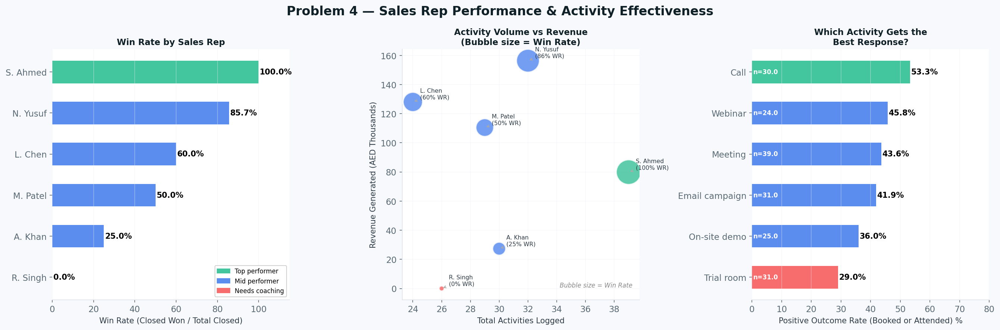

# Mugdad Elneama - Data Analyst Portfolio

📧 **Email:** megdad.2003@gmail.com  
💼 **LinkedIn:** [linkedin.com/in/mugdad-elneama-249a5a228](https://www.linkedin.com/in/mugdad-h-eltayeb-249a5a228/))  
📱 **Phone:** +971 56 675 4494  
📍 **Location:** Abu Dhabi, UAE

---

## About Me

I turn messy data into decisions business owners can act on.

By day, I manage patient data systems and scheduling workflows for a hospital. Accuracy isn't optional there. I maintain records for thousands of patients across departments. I run regular quality checks to catch errors before they cause problems. I track inquiry patterns to spot where service breaks down.

That work taught me something most data analysts never learn on the job. Data is only useful if someone acts on it. A clean spreadsheet means nothing if it doesn't change what a manager does next week.

Now I bring that same discipline to small and mid-size businesses. I build sales dashboards and churn analysis using Python, SQL, and Power BI. I show founders exactly where revenue is leaking. I show them which customers are about to walk — before it's too late.

Recent project: I analyzed 12 months of UAE B2B sales data. Delivery delays jumped from 48.6% to 69.2% of orders in three months. The business hadn't caught this pattern in its own reports.
If you run a retail, e-commerce, or field service business, this is for you. If you're making decisions on gut feel instead of your own numbers, that's exactly the gap I close.
DM me if this sounds like your business.

---

## Featured Projects

### **1. Newcom B2B Sales Analysis**
### Finding hidden revenue risks in a UAE technology distributor's data

---

## Project Overview

Newcom is a UAE-based B2B technology distributor selling collaboration hardware — room kits, headsets, docking stations, and display equipment — to corporate clients across Dubai and the Northern Emirates.

This project applies Python-based data analysis to six interconnected datasets covering customers, sales opportunities, completed orders, products, inventory, and sales activities. The goal is not to describe the data — it is to find real business problems, quantify them, and tell the business exactly what to do about them.

The notebook reads like a business report. Every chart is followed by a plain-English finding and one specific recommendation. No data science jargon. No exploratory filler.

---

## Business Problems Solved

### Problem 1 — Revenue Concentration Risk
Three customers generate 61% of total revenue (AED 5.97M of AED 9.79M). Three SKUs generate 82.3% of all revenue. If a single account reduces spend or a key product faces a supply issue, the business takes a catastrophic hit. The analysis identifies every single point of failure and proposes a diversification target.


### Problem 2 — Pipeline Conversion Breakdown
180 deals in the pipeline. Only 21 reached Closed Won — an 11.7% end-to-end win rate. The biggest drop-off happens at the final stage (Negotiation → Closed Won, a 22% fall). "No decision" accounts for 36% of all lost deals. AED 4.25 million is frozen in deals that have passed their expected close date. The analysis pinpoints where deals are dying and why.


### Problem 3 — Delivery Performance and Customer Trust
55% of all orders were delivered late. The late rate climbed from 48.6% in June to 69.2% in September — getting worse every month. Three SKUs are both chronically late and below safety stock level, including two with zero units on hand still accepting orders. The analysis flags every operational risk and cross-references inventory data to identify the root cause.


### Problem 4 — Sales Rep Performance and Activity Effectiveness
One rep (S. Ahmed) has a 100% win rate. Another (R. Singh) has zero closed deals despite 26 logged activities. More activity does not equal more revenue — the analysis proves it. It identifies which rep to coach, which to replicate, and which activity type produces the highest qualified engagement rate.

---

## Dataset

Real B2B sales data from a UAE technology distributor, anonymised for portfolio use.

| Sheet | Rows | Description |
|---|---|---|
| `customers` | 60 | Client accounts with segment, vertical, region, and assigned sales owner |
| `opportunities` | 180 | Pipeline deals with stage, value, product, expected close date, and lost reason |
| `orders` | 120 | Completed orders with SKU, quantity, pricing, promised and actual delivery dates |
| `products` | 16 | SKU catalogue with category, brand, margin band, and list price |
| `inventory` | 16 | Stock levels, on-order quantity, safety stock, and lead times |
| `activities` | 180 | Sales activities (calls, webinars, demos, trial rooms) with owner and outcome |

---

## Methodology

### Data Cleaning (6 specific fixes)
- Date columns validated and standardised across all sheets
- 7 missing `owner` values assigned to "Unassigned" (not dropped)
- Missing `lost_reason` values on open deals labelled "Active" to prevent skewing loss analysis
- `revenue` column calculated: `quantity × unit_price`
- `delay_days` column calculated: `actual_eta − promised_eta` (negative = early, positive = late)
- Sheets merged using `customer_id` and `sku` as join keys
- Cleaned datasets exported to `/data/processed/` as CSVs for reproducibility

### Analysis Approach
Each business problem follows the same structure:
1. Data preparation and calculation
2. Multi-panel chart (3 visuals per problem, matplotlib/seaborn)
3. Plain-English finding with specific numbers
4. One actionable recommendation
5. Executive summary at the end with four verb-first action items

---

## Key Findings

| # | Finding | Number |
|---|---|---|
| 1 | Top 3 customers as % of total revenue | **61%** |
| 1 | Top 3 SKUs as % of total revenue | **82.3%** |
| 2 | End-to-end pipeline win rate | **11.7%** |
| 2 | Revenue frozen in overdue deals | **AED 4.25M** |
| 2 | Deals lost due to "no decision" | **36%** |
| 3 | Orders delivered late | **55%** |
| 3 | Late delivery rate in September | **69.2%** |
| 3 | SKUs at zero stock still accepting orders | **2** |
| 4 | Top rep win rate (S. Ahmed) | **100%** |
| 4 | Bottom rep closed deals (R. Singh) | **0 from 26 activities** |

---

## Technologies Used

| Tool | Purpose |
|---|---|
| Python 3.11 | Core analysis language |
| pandas | Data cleaning, transformation, and aggregation |
| NumPy | Numerical calculations |
| matplotlib | All chart production |
| seaborn | Chart styling and statistical plots |
| Jupyter Notebook | Report structure and narrative |
| openpyxl | Reading multi-sheet Excel source file |

No Power BI. All visuals are static matplotlib/seaborn figures embedded directly in the notebook — keeping the report self-contained and reproducible in any Python environment.

---

## Project Structure

```
newcom-sales-analysis/
│
├── newcom_sales_analysis.ipynb   # Main analysis notebook
├── README.md                     # This file
│
├── data/
│   ├── raw/
│   │   └── Original_Newcom_Data.xlsx
│   └── processed/
│       ├── orders_clean.csv
│       ├── opps_clean.csv
│       ├── customers_clean.csv
│       └── activities_clean.csv
│
└── assets/
    └── screenshots/              # Dashboard screenshots for portfolio
```

---

## How to Run

**Requirements:** Python 3.8+, Jupyter Notebook or JupyterLab

```bash
# Clone the repo
git clone https://github.com/YOUR_USERNAME/newcom-sales-analysis.git
cd newcom-sales-analysis

# Install dependencies
pip install pandas numpy matplotlib seaborn openpyxl jupyterlab

# Launch the notebook
jupyter lab newcom_sales_analysis.ipynb
```

Run all cells top to bottom. The notebook reads and cleans the raw Excel file automatically and exports clean CSVs to `/data/processed/`.

---

## What I Would Add Next

- **Churn prediction model** — flag accounts with declining order frequency using logistic regression on recency, frequency, and value (RFV) features
- **Power BI dashboard** — connect to the cleaned CSVs to build an interactive version for non-technical stakeholders who need to filter by rep, region, or product without running Python
- **Inventory reorder alert** — a script that flags any SKU crossing below safety stock and outputs a purchase order draft
- **Monthly automation** — refactor the notebook into a parameterised script that re-runs the full analysis in under 60 seconds when a new data file is dropped in

---

## About

Independent data analytics consultant based in Abu Dhabi, UAE. I help SMB founders and sales managers find the revenue risks hiding in their data — customer concentration, pipeline blockages, delivery failures, and team performance gaps.

**Connect on LinkedIn:** [linkedin.com/in/YOUR_PROFILE](https://linkedin.com/in/YOUR_PROFILE)

---

## Technical Skills

**Programming Languages:** Python (Pandas, NumPy, Matplotlib, Seaborn), SQL

**Data Analysis:** Exploratory Data Analysis (EDA), Statistical Analysis, Data Cleaning, Data Wrangling, Data Validation

**Data Visualization:** Power BI, Matplotlib, Seaborn, Excel Charts

**Business Intelligence:** Dashboard Development, KPI Reporting, Performance Metrics, Trend Analysis

**Spreadsheet Tools:** Microsoft Excel (Pivot Tables, VLOOKUP, XLOOKUP, Conditional Formatting, Reporting Automation)

**Databases:** MySQL, SQL Querying, Database Management, Firebase

**ETL & Data Processing:** Data Extraction, Data Transformation, Data Loading, Data Pipeline Development

**Other Tools:** Git, GitHub, REST APIs, Microsoft Office Suite

---

## Contact

Feel free to reach out for collaboration opportunities or data analysis projects!

📧 **Email:** [megdad.2003@gmail.com](mailto:megdad.2003@gmail.com)  
💼 **LinkedIn:** [linkedin.com/in/mugdad-elneama-249a5a228](https://linkedin.com/in/mugdad-elneama-249a5a228)  
📱 **Phone:** +971 56 675 4494  
📍 **Location:** Dubai, UAE

---

<!--**[View Resume (PDF)](assets/docs/Mugdad_Resume.pdf)**-->
